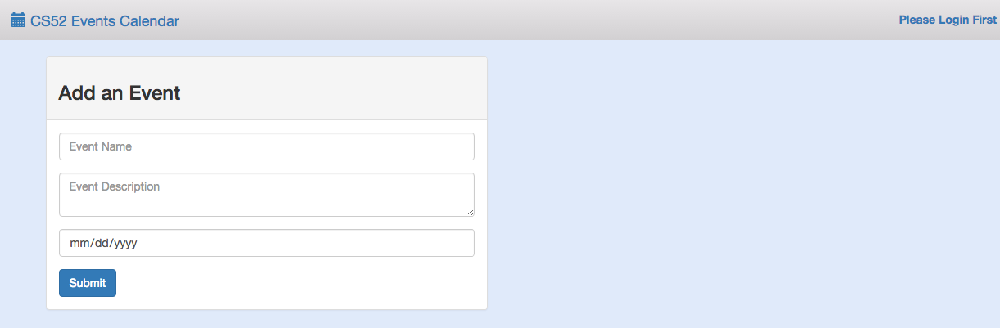
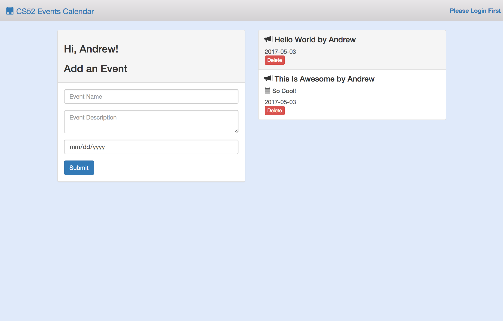

We will be using Vue.js and Flask for this workshop. Vue is a javascript framework that we will be using for frontend and Flask is a python-written framework that we will be using for backend.

## Goals for the Workshop:
We'll be building a single page app that can do the following:
* Takes as input different events for our class posted by each student
* The output is a collaborative notice board for cs52!
* Our hope is to guide you through the steps and have you pick up some Vue and Flask along the way!

Be sure to look out for the following notations:
* :computer: run in terminal
* :rocket: this is a key step

:warning: Follow instructions carefully!!!

## Clone the Repo
Fork it [here](https://github.com/allisonchuang/altstack_workshop) and then clone the repo

## Install Vue
Now we want to install vue.js and vue resource, as well as bootstrap for frontend formatting. Vue resource allows us to make web requests.

:computer: Install vue.js, vue resource, and bootstrap from your command line:
```
npm install vue vue-resource bootstrap
```

## Import vue.js and vue
Import vue.js and vue resource into your html. :rocket: Put these tags at the end of your html body:
``` html
<script src="node_modules/vue/dist/vue.js"></script>
<script src="node_modules/vue-resource/dist/vue-resource.js"></script>
<script src="https://code.jquery.com/jquery-3.2.1.min.js"
integrity="sha256-hwg4gsxgFZhOsEEamdOYGBf13FyQuiTwlAQgxVSNgt4="
crossorigin="anonymous"></script>
<script src="app.js"></script>
```
:computer: Let’s run it to see what it looks like:
```
python -m SimpleHTTPServer 9000
```
Visit http://localhost:9000/! Your site should look something like this:


**Fun fact**: You can sign in! On the top right corner log in with your name. The app should greet you now.

## Create a Vue instance
:rocket: Copy and paste this into the end of your **app.js** file:
``` javascript
var eventsPage = new Vue({

  // We want to target the div with an id of 'events'
  el: '#events',

  // Here we can register any values or collections that hold data
  // for the application
  data: {
    event: { user: '', name: '', description: '', date: '' },
    events: []
  },

  // Anything within the mounted function will run when the application loads
  mounted: function() {
    // call fetchEvents here!
  },

  // Methods we want to use in our application are registered here
  methods: {
    // add fetchEvents, addEvent, and deleteEvent
  }
});
```
What do we have here?
* **el** targets divs with a #events id. Now vue will be available wherever div id=#events.
* **data** will be the object where the html can access vue’s data
* **mounted** is a function that will be called when the app loads and used to call other methods that will initialize the app’s data
* **methods** is where we will hold all our functions

Since the html is now reading a vue instance of the events page, your app should now look like this:


## Incorporate Vue into the html
Let’s connect our html to vue! In the div class “panel-body” in **index.html**, you will see three “form-group” classes. In each class is either an input or a textarea element.
:rocket: We are going to use **v-model** to incorporate vue like in line 39:
``` html
<input class="form-control" placeholder="Event Name" v-model="event.name">
```
:rocket: Now do the same for description and date inputs by using **event.description** and **event.date**. For the textarea and input add **v-model="[the event info you want to add]"**

V-model assigns a specific spot on an event to it’s element. The value we input into these fields will be attached to ViewModel and be available for vue.

We also want to add an on-click event for vue to handle. :rocket: In the button element of the panel-body class, add:
```
v-on:click="addEvent"
```
v-on specifies the type of event that you want an element to react to.

## Add some events
Let's get our app to be able to add events! First we need a way to fetch events and render them. Lets create a fetchEvents method in **app.js**. :rocket: in the **methods** portion of the **eventsPage** instance in app.js put:
``` javascript
fetchEvents: function() {
  var events = [];
  this.events = events;
},
```
Notice **this.events**. It's kind of like React! We're basically resetting vue's events here.

:rocket: Now add fetchEvents to your **mounted** function in the **eventsPage** instance. We will want to call it as:
``` javascript
this.fetchEvents();
```

Next we want the user to be able to add additional events. :rocket: Add this to methods as well:
``` javascript
addEvent: function() {
  if(this.event.name) {
    this.event.user = user;
    // ADD CODE BELOW
    // push the event to this.events below!

    this.event = { name: '', user: '', description: '', date: '' };
  }
},
```
:rocket: YOU'RE NOT DONE WITH THAT FUNCTION. YOU MUST ADD CODE. Here's what's suppose to happen: if a name is inputted, then the function will set the user and then push the current event. How do we do this? The event that you want to push is called **this.event**. The events that you are pushing to is called **this.events**. Use **push** to add this.event to this.events.

Finally, add a delete function. :rocket: Add this to methods:
``` javascript
deleteEvent: function(index) {
  if(confirm("Are you sure you want to delete this event?")) {
    this.events.splice(index, 1);
  }
},
```

Yay! Now you can add and delete events!

:rocket:: Add an event with the name of your favorite ice cream flavor and take a screenshot of your posted event. You'll submit this screenshot on canvas.

## Rendering events
But wait, your events show no content. That's because we have to connect the data to vue. Go to the "list-group" class in **index.html**. First, notice **v-for="(event, index) in events"** in the "list-group-item" class. What this does is loop through all the events from vue.

Now notice the use of **{{ event.name }} by {{ event.user }}**. What's going on here? Basically the html is now accessing the user-inputted name for each event, as well as the username.

:rocket: Now try it! Let the html handle each event's date and description. Use **event.date** and **event.description**.

## Hooray!
Now you have the frontend of your app working! Check it out!
:computer::
```
python -m SimpleHTTPServer 9000
```
After adding events, you should get something like this:



## Part 2: Backend
You thought you were done, didn't you. However, when you reload the page, your event disappears! So, we want to connect our page to a backend so that we can create permanent CS52 events. First, a little bit about Flask and what we did for this workshop..

## Flask
Using python, Flask, and MySQL we built a REST api to add, delete, and fetch events. You can look at that code [here](https://github.com/mattgirouard/vue-flask-workshop-backend). Briefly take a look at **api.py** in the repo. You'll get a sense of what Flask does and may want to know a bit about it for later (hint hint wink wink). This code is deployed on a Heroku server. We will be making GET and POST calls to this server below.

## Connecting to backend
Now it's time to complete the backend part of this assignment! Since Flask has already been set up for you, all you have to do for this workshop is connect the vue event methods to the database. In your **app.js** you should currently have three methods for your vue instance: fetchEvents, addEvent, and deleteEvent.

### fetchEvents
:rocket: In your fetchEvents method, replace the code you have with this:
``` javascript
let events = '';
let arr = [];
$.get("https://hidden-retreat-66994.herokuapp.com/AllEvents", (data) => {
  arr = JSON.parse(data);
  this.events =  arr;
});
```
Now you're grabbing events that exist in the database!

### addEvent
Now it's time to add your own events to the database. Take a look at your current addEvent method:
``` javascript
addEvent: function() {
  if(this.event.name) {
    this.event.user = user;
    this.events.push(this.event);
    // ADD YOUR CODE HERE

    this.event = { name: '', user: '', description: '', date: '' };
  }
},
```
:rocket: Where it specifies to add code, insert this:
``` javascript
$.post("https://hidden-retreat-66994.herokuapp.com/PutEvent", {
    name: this.event.name,
    user: // ADD USER HERE
    description: // ADD DESCRIPTION HERE
    date: // ADD DATE HERE
}).done( function(data) {
  window.location.reload();
});
```
:rocket: NOTICE. YOU HAVE TO ADD MORE. See how we're setting name for the event going into the database with **this.event.name**?
We are taking the info we've created in vue and adding them to the event info for the database. Add the rest of the information!

### deleteEvent
Finally, take a look at your deleteEvent method. :rocket: Replace **this.events.splice(index, 1);** with:
``` javascript
$.post("https://hidden-retreat-66994.herokuapp.com/DeleteEvent", {
    name: this.events[index].name,
    user: this.events[index].user,
    description: this.events[index].description,
    date: this.events[index].date,
}).done( function(data) {
  window.location.reload();
});
```
We're deleting the event in the database based on it's index.

## Celebrate!!
Hooray!!! Now you're actually finished!

:computer: Take a look!
```
python -m SimpleHTTPServer 9000
```
Now we have a cs52 class page of events!!

# BUT WAIT, THERE'S MORE
In addition to your regular canvas submission, submit the answer to:

**How do you build a REST api with python, Flask, and MySQL?**

Haha jokes but seriously take a look at the back end. It's pretty cool!

For clarification: you don't actually have to right anything.

## Checklist
:white_check_mark: Installed vue and served a non-reactive events page <br/>
:white_check_mark: Implemented vue in app and created a reactive events page <br/>
:white_check_mark: Connected your events page to our backend database <br/>
:white_check_mark: Sign in and make a post! Jokes appreciated <br/>
:white_check_mark: Optional: make it even cooler!
