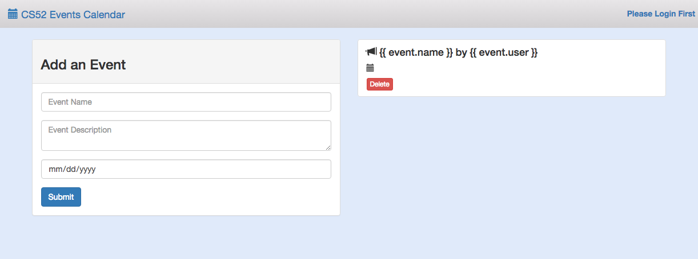

We will be using Vue.js and Flask for this workshop. Vue is a javascript framework that we will be using for frontend and Flask is a python-written framework that we will be using for backend.

Be sure to look out for the following notations:
* :computer: run in terminal
* :rocket: this is a key step

## Clone the Repo
Fork it [here](https://github.com/allisonchuang/altstack_workshop) and then clone the repo

## Install Vue
Now we want to install vue.js and vue resource, as well as bootstrap for frontend formatting. Vue resource allows us to make web requests.

:computer: Install vue.js, vue resource, and bootstrap from your command line:
```
npm install vue vue-resource bootstrap
```

## Install Flask
:computer: Now we want to install Flask:
```
pip install Flask
```

## Import vue.js and vue
Import vue.js and vue resource into your html. :rocket: Put these tags at the end of your html body:
``` html
<script src="node_modules/vue/dist/vue.js"></script>
<script src="node_modules/vue-resource/dist/vue-resource.js"></script>
<script src="app.js"></script>
```
:computer: Let’s run it to see what it looks like:
```
Python -m SimpleHTTPSERVER 9000
```
Visit http://localhost:9000/! Your site should look something like this:



Fun fact: You can sign in! On the top right corner log in with your name. The app should greet you now.

## Create a Vue instance
:rocket: Copy and paste this into the end of your **app.js** file:
``` javascript
var someVue = new Vue({

  // We want to target the div with an id of 'events'
  el: '#events',

  // Here we can register any values or collections that hold data
  // for the application
  data: {
    event: { user: '', name: '', description: '', date: '' },
    events: []
  },

  // Anything within the ready function will run when the application loads
  mounted: function() {},

  // Methods we want to use in our application are registered here
  methods: {}
});
```
What do we have here?
* **el** targets divs with a #events id. Now vue will be available wherever div id=#events.
* **data** will be the object where the html can access vue’s data
* **mounted** is a function that will be called when the app loads and used to call other methods that will initialize the app’s data
* **methods** is where we will hold all our functions

## Incorporate Vue into the html
Let’s connect our html to vue! In the div class “panel-body” in **index.html**, you will see three “form-group” classes. In each class is either an input or a textarea element.
:rocket: We are going to use **v-model** to incorporate vue like so:
``` html
<input class="form-control" placeholder="Event Name" v-model="event.name">
```
:rocket: Now do the same for description and date inputs by using **event.description** and **event.date**.

V-model assigns a specific spot on an event to it’s element. The value we input into these fields will be attached to ViewModel and be available for vue.

We also want to add an on-click event for vue to handle. :rocket: In the button element of the panel-body class, add:
```
v-on:click="addEvent"
```
v-on specifies the type of event that you want an element to react to.

## Add some events
Let's get our app to be able to add events! First we need a way to fetch events and render them. :rocket: Lets create a fetchEvents method in **app.js**:
``` javascript
fetchEvents: function() {
  var events = [
    {
      id: 1,
      name: 'TIFF',
      description: 'Toronto International Film Festival',
      date: '2015-09-10'
    },
  ];
  this.events = events;
},
```
Notice **this.events**. It's kind of like React! We're basically resetting vue's events here.

:rocket: Now add fetchEvents to your mounted function. We will want to call it **this.fetchEvents();**.

Finally we want the user to be able to add additional events. :rocket: Add this to methods as well:
``` javascript
addEvent: function() {
  if(this.event.name) {
    this.event.user = user;
    // push the event to this.events below!

    this.event = { name: '', user: '', description: '', date: '' };
  }
},
```
Here's what's suppose to happen: if a name is inputted, then the function will set the user and then push the current event. How do we do this? The event that you want to push is called **this.event**. The events that you are pushing to is called **this.events**. Use **push** to add this.event to this.events.

Yay! Now you can add events!

## Rendering events
But wait, your events show no content. That's because we have to connect the data to vue. Go to the "list-group" class in **index.html**. First notice **v-for="(event, index) in events"** in the "list-group-item" class. What this does is loop through all the events stored in vue.

Now notice the use of **{{ event.name }} by {{ event.user }}**. What's going on here? Basically the html is now accessing the user-inputted name for each event, as well as the username.

Now try it! Let the html handle each event's date and description. Use **event.date** and **event.description**.

## Hooray!
Now you have the front-end of your app working! Check it out!
```
Python -m SimpleHTTPSERVER 9000
```
You should get something like this:

IMAGE


Testing out Vue


Trying Vue for the first time, and getting [this awesome tutorial](https://scotch.io/tutorials/build-an-app-with-vue-js-a-lightweight-alternative-to-angularjs)
working with Vue 2.0.
